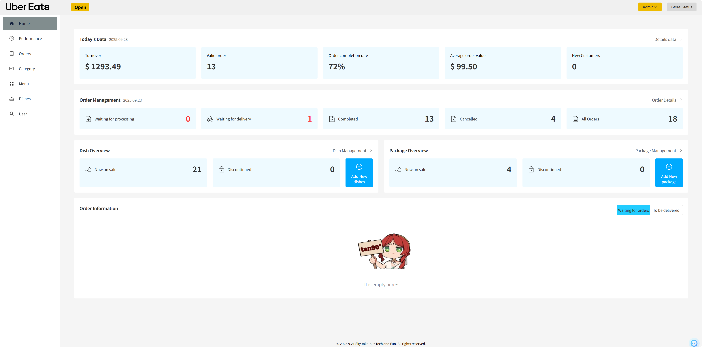
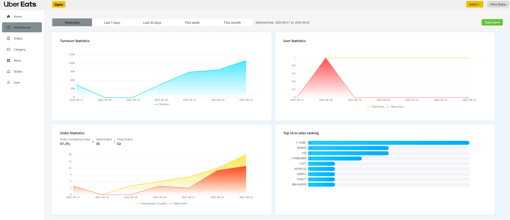
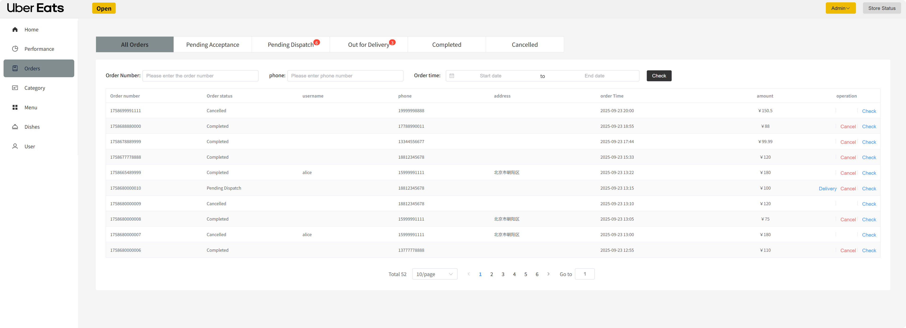

# Sky Take-Out System

🍔 A full-stack food delivery system built with **Vue 3 + Uniapp + ElementUI** for frontend and **SpringBoot 3.2.5 + MyBatis + MySQL + Redis** for backend.  
This project demonstrates a modular architecture, responsive frontend design, and RESTful API integration.

---

## 🌟 Technology Stack

### Backend
- **Framework**: SpringBoot 3.2.5  
- **ORM**: MyBatis  
- **Database**: MySQL  
- **Cache**: Redis  
- **JDK Version**: 17+  
- **Build Tool**: Maven 3.9.6  

### Frontend
- **Framework**: Vue 3 + TypeScript + Uniapp  
- **UI Library**: Element Plus  
- **State Management**: Pinia  
- **Charting**: ECharts  
- **Node Version**: 20.11.1 (>=16 recommended)  

### Communication
- **Frontend ↔ Backend**: RESTful API  

---

## 🏗 Architecture Overview

### 1) User Layer
- System admin pages: H5, Vue.js, ElementUI, Apache ECharts  
- Mobile apps: WeChat Mini Program  

### 2) Gateway Layer
- **Nginx**: HTTP server, static file deployment, reverse proxy, load balancing for Tomcat  

### 3) Application Layer
- **SpringBoot**: Rapid Spring project setup ("Convention over Configuration")  
- **SpringMVC**: Integrated seamlessly with Spring  
- **Spring Task**: Scheduled tasks  
- **HttpClient**: HTTP requests  
- **Spring Cache**: Caching framework  
- **JWT**: User authentication  
- **Alibaba OSS**: Object storage for files/images  
- **Swagger / Knife4j**: API documentation and testing  
- **POI**: Excel operations  
- **WebSocket**: Real-time order notification  

### 4) Data Layer
- **MySQL**: Core business data storage  
- **Redis**: Key-value cache for fast access  
- **MyBatis**: Data persistence layer  
- **PageHelper**: Pagination plugin  
- **Spring Data Redis**: Simplified Redis operations  

### 5) Tools
- **Git**: Version control  
- **Maven**: Build and dependency management  
- **JUnit**: Unit testing  
- **Postman / Apifox**: API testing and mock services  

---

## 📝 API Documentation
- Managed with **Apifox** (Postman + Swagger + Mock + JMeter) for simplified configuration and powerful testing.

---

## ⚙️ Setup Instructions

1. Clone the repository and open in **VS Code** (frontend) and **IDEA** (backend).  
2. **Backend Setup**:
   - Create database and tables using provided SQL file  
   - Update database credentials in `application.yml`  
3. **Frontend Setup**:
   - Create Vue 3 project scaffold  
   - Import frontend code  
   - Install dependencies: `npm install`  
   - Start dev server: `npm run dev`  

---
## 🛠 Frontend Features

| Module             | Description                                                                 |
|-------------------|-----------------------------------------------------------------------------|
| 🏠 **Homepage**      | Promotions carousel, product categories, new arrivals, bestseller list, sidebar recommendations |
| 📚 **Category Page** | Multi-level product categories, breadcrumbs, subcategory display         |
| 📦 **Product Detail** | Image carousel, SKU selection, quantity input, add to cart, promotions   |
| 🛒 **Shopping Cart**  | Item list, quantity adjustment, select/delete items, total calculation    |
| ✅ **Checkout**       | Address management, delivery time/payment selection, order submission      |
| 💰 **Payment**        | Countdown timer, multiple payment options, callback handling                |
| 👤 **User Area**      | Login/logout, personal dashboard, user info display                        |
| 📱 **Responsive Design** | Mobile-first layout adapts to desktop/tablet/mobile screens           |

## 📁 Frontend Structure

```bash
.
├── .vscode                  # Editor config
├── node_modules             # Installed packages
├── public/
│   └── logo.ico             # Favicon
├── src/
│   ├── api/                 # API modules
│   ├── assets/              # Static assets
│   │   ├── components/      # Common components
│   │   ├── store/           # Pinia stores
│   │   ├── types/           # TypeScript type definitions
│   │   └── utils/           # Utilities (e.g., request.ts)
│   ├── views/               # Page components
│   │   ├── layout/          # Layout components
│   │   │   ├── page1/       # Sub-page 1
│   │   │   │   └── components/ # Sub-page components
│   │   │   └── index.vue    # Sub-page
│   │   └── ...              # Other pages
│   ├── App.vue              # Root component
│   ├── main.ts              # Entry point (register ElementPlus, Pinia, etc.)
│   └── router.ts            # Router config
├── .eslintrc.js             # Lint configuration
├── .gitignore               # Git ignore
├── .prettierrc.json         # Prettier config
├── env.d.ts                 # Dev environment types
├── index.html               # Main HTML
├── package.json             # Dependencies
├── package-lock.json        # Package lock
├── tsconfig.xxx.json        # TypeScript config
├── vite.config.ts           # Vite config
└── vitest.config.ts         # Test config
└── README.md                # Project description
```

## 🏗 Backend Module Overview

| Module        | Description                                                      |
|---------------|------------------------------------------------------------------|
| sky-take-out  | Maven parent project, aggregates submodules                     |
| sky-common    | Common classes: utils, constants, exceptions                    |
| sky-pojo      | Entities, DTOs, VOs, POJOs                                      |
| sky-server    | Controllers, Services, Mappers, Config, Interceptors            |

### Common Packages
- **constant**: Constants  
- **context**: Context classes  
- **enumeration**: Enum classes  
- **exception**: Custom exceptions  
- **json**: JSON utilities  
- **properties**: SpringBoot config classes  
- **result**: Response wrapper  
- **utils**: Common utilities  

### POJO Packages
- **Entity**: Database entities  
- **DTO**: Data Transfer Objects  
- **VO**: View Objects for frontend  
- **POJO**: Plain objects  

### Server Packages
- **config**: Configuration classes  
- **controller**: Controller layer  
- **interceptor**: Interceptors  
- **mapper**: Mapper interfaces  
- **service**: Service layer  
- **SkyApplication**: Main application class  

---
## 📸 Screenshots

### 1. Homepage
<div align="center">
  
</div>

### 2. Data Statistics
<div align="center">
  
</div>

### 3. Order Overview
<div align="center">
  
</div>

### 4. Dish Categories
<div align="center">
  
</div>


